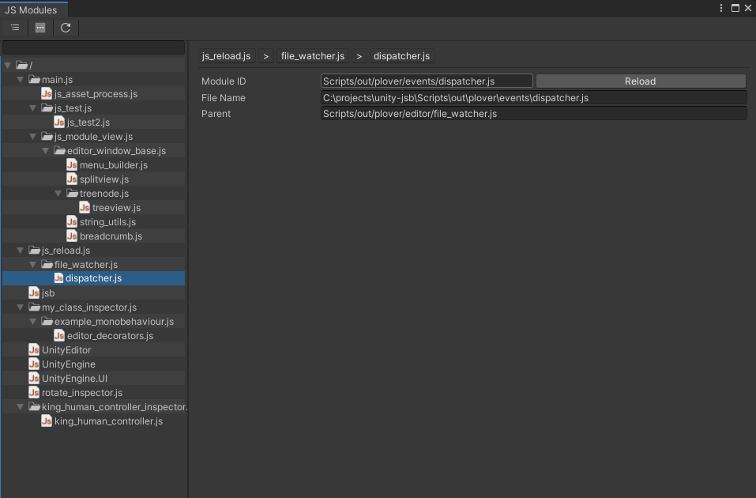
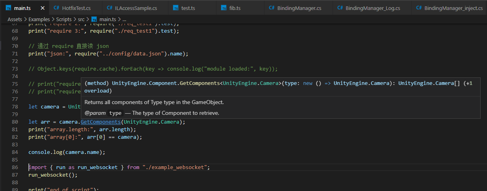
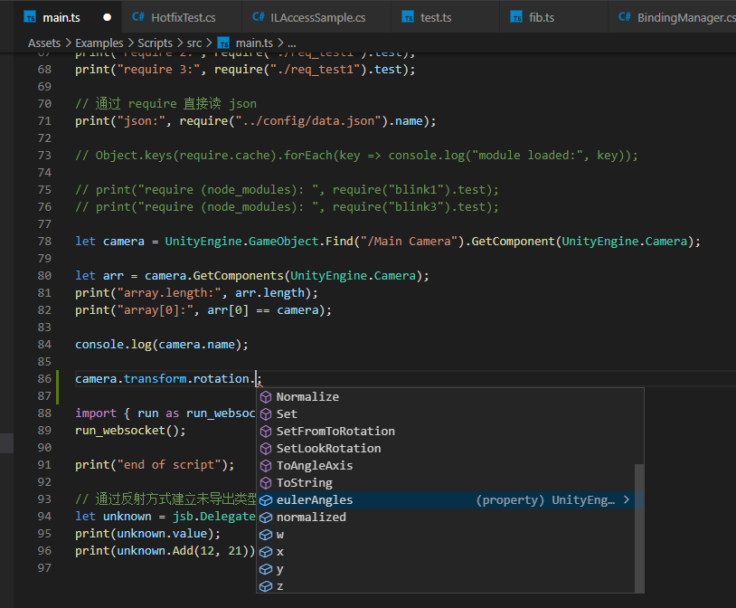

# unity-jsb

[](https://openupm.com/packages/cc.starlessnight.unity-jsb/)

It brings Javascript runtime capability to Unity3D by integrating [QuickJS](https://bellard.org/quickjs/).<br/> 

> **v8 is experimentally supported as an alternative backend (only on Windows x64 for now)**.

> QuickJS is a small and embeddable Javascript engine. It supports the ES2020 specification including modules, asynchronous generators, proxies and BigInt. 

# Features
* Unity3D coroutines and C# tasks support in JS async function
* Operator overloading for Vector2/Vector3 etc. (only supported by QuickJS)
* [Javascript hotload](#Hotload) in development
* Highly integrated with Unity3D
    * JS implemented MonoBehaviour (include Prefab)
    * JS implemented EditorWindow
    * JS implemented Editor (Inspector)
    * JS implemented ScriptableObject
    * JS implemented AssetPostProcessor
* JS/C# interaction without glue code in development
* Generates glue code for better performance
* [UNFINISHED] JS Worker
* [UNFINISHED] Hotfix on C#

> Supports .NET 4.0 / dotnetcore 3.1 / Unity2019+ (Windows/macOS/iOS/Android)  x86/x64/arm64

# Samples
> Typescript is the preferred language in unity-jsb, the definition files (d.ts) of exported C# types could be generated by one-click simplicity.

## Extends MonoBehaviour 

```ts
// the namespace will be mapped into module in javascript
// it's not always necessary to write type-imports manually, intellisense could finish it automatically and properly in VSCode
import { MonoBehaviour, WaitForSeconds, Object, GameObject } from "UnityEngine";

class MyClass extends MonoBehaviour {
    protected _tick = 0;

    Awake() {
        console.log("MyClass.Awake", this._tick++);
    }

    async OnEnable() {
        console.log("MyClass.OnEnable", this._tick++);
        await jsb.Yield(new WaitForSeconds(1));
        console.log("MyClass.OnEnable (delayed)", this._tick++);
    }

    OnDisable() {
        console.log("MyClass.OnDisable", this._tick++);
    }

    OnDestroy() {
        console.log("MyClass.OnDestroy", this._tick++);
    }

    async test() {
        console.log("MyClass.test (will be destroied after 5 secs.", this.transform);
        await jsb.Yield(new WaitForSeconds(5));
        Object.Destroy(this.gameObject);
    }
}

// with @ScriptType decorator, this class will be recognized by Unity Editor
@ScriptType()
export class MySubClass extends MyClass {

    // make this field be serialized automatically
    @ScriptInteger()
    year = 2021;

    @ScriptInteger()
    month = 5;

    @ScriptString()
    theName = "Bob";

    Awake() {
        super.Awake();
        console.log("MySubClass.Awake", this._tick++);
    }

    play() {
        console.log("MySubClass.play");
    }
}

let gameObject = new GameObject();
let comp = gameObject.AddComponent(MySubClass);

comp.play();

let comp_bySuperClass = gameObject.GetComponent(MyClass);
comp_bySuperClass.test();
```

## Extends EditorWindow

```ts
import { EditorWindow } from "UnityEditor";
import { GUILayout, GUIContent } from "UnityEngine";

// with @ScriptEditorWindow decorator, the type will be listed in script launchpad window (Menu: JS Bridge -> Script Editor Window Launcher)
@ScriptEditorWindow()
export class MyEditorWindow extends EditorWindow {
    Awake() {
        console.log("MyEditorWindow.Awake");
    }

    OnEnable() {
        this.titleContent = new GUIContent("Blablabla");
    }

    OnGUI() {
        if (GUILayout.Button("I am Javascript")) {
            console.log("Thanks");
        }
    }
}
```

## Hotload
Script hot-load is supported, you can run the game, edit scripts without stopping playing to see the change affects immediately. The class instance including member variables in scripts (MonoBehaviour/EditorWindow) will be retained, only the type of class itself will be replaced on the fly to the new version.


## Editor Scripting
Supports editor scripting:
* Editor
* EditorWindow
* ScriptableObject
* AssetPostProcessor

> Here is an example of EditorWindow totally implemented in typescript. 



## Async Functions
* await Unity3D coroutines
* await C# Tasks

```ts
import { WaitForSeconds } from "UnityEngine";
import { IPHostEntry } from "System.Net";
import { AsyncTaskTest } from "Example";
import * as jsb from "jsb";

async function testAsyncFunc () {
    console.log("you can await any Unity YieldInstructions");
    await jsb.Yield(new WaitForSeconds(1.2));
    await jsb.Yield(null);

    console.log("setTimeout support")
    await new Promise(resolve => {
        setTimeout(() => resolve(), 1000);    
    });

    // System.Threading.Tasks.Task<System.Net.IPHostEntry>
    let result = <IPHostEntry> await jsb.Yield(Example.AsyncTaskTest.GetHostEntryAsync("www.baidu.com"));
    console.log("host entry:", result.HostName);
}

testAsyncFunc();
```

## Operator overloading
> ```Vector3 * Vector3``` or ```Vector3 * float``` is all right, but be caution that there is no value type in Javascript, Vector3 is by-ref in Javascript.

```ts
{
    let vec1 = new Vector3(1, 2, 3);
    let vec2 = new Vector3(9, 8, 7);
    
    // @ts-ignore
    let vec3 = vec1 + vec2; 
    let vec4 = vec1 + vec2;
    console.log(vec3);
    console.log(vec3 / 3);
    console.log(vec3 == vec4);
}
{
    let vec1 = new Vector2(1, 2);
    let vec2 = new Vector2(9, 8);
    let vec3 = vec1 + vec2;
    console.log(vec3);
}
```

## Modules

```ts
// Supports commonjs modules (require)

require("./test");

// commonjs modules cache access
Object.keys(require.cache).forEach(key => console.log(key));
```

## WebSocket 

```ts
let ws = new WebSocket("ws://127.0.0.1:8080/websocket", "default");

console.log("websocket connecting:", ws.url);

ws.onopen = function () {
    console.log("[ws.onopen]", ws.readyState);
    let count = 0;
    setInterval(function () {
        ws.send("websocket message test" + count++);
    }, 1000);
};
ws.onclose = function () {
    console.log("[ws.onclose]", ws.readyState);
};
ws.onerror = function (err) {
    console.log("[ws.onerror]", err);
};
ws.onmessage = function (msg) {
    console.log("[ws.recv]", msg);
};
```

## XMLHttpRequest

```ts
let xhr = new XMLHttpRequest();
xhr.open("GET", "http://127.0.0.1:8080/windows/checksum.txt");
xhr.timeout = 1000;
xhr.onreadystatechange = function () {
    console.log("readyState:", xhr.readyState);
    if (xhr.readyState !== 4) {
        return;
    }
    console.log("status:", xhr.status);
    if (xhr.status == 200) {
        console.log("responseText:", xhr.responseText);
    }
}
xhr.send();
```

## Worker
> This feature is UNFINISHED, all C# types are not exported into Worker runtime at present.

```ts
/// master.js

let worker = new Worker("worker");

worker.onmessage = function (data) { 
    console.log("master receive message from worker", data);
}

// setTimeout(function () { worker.terminate(); }, 5000);

/// worker.js 

setInterval(function () {
    postMessage("message form worker");
}, 3000)

onmessage = function (data) {
    console.log("worker get message from master:", data);
}

```

## Hotfix
> You can replace a tagged C# member method by a script function at runtime. This feature is UNFINISHED.

```ts

// replace method in C# class
jsb.hotfix.replace_single("HotfixTest", "Foo", function (x: number) {
    // CAUTION: private memebers will be accessible in scripts after hotfix
    // if the replaced method is instance method, 'this' refers to C# object instance
    // otherwise, 'this' refers to the type itself (JS Constructor)
    console.log("replace C# method body by js function", this.value); 
    return x;
});

// insert code snippet before method in C# class
jsb.hotfix.before_single("HotfixTest", "AnotherCall", function () {
    print("this will be executed before C# code");
});


```

### Unity API Docs included in d.ts


### Strong-typed


# How to get the minimalistic jsb package

You could add jsb as a UPM package with this URL: [https://github.com/ialex32x/unity-jsb.git#upm](https://github.com/ialex32x/unity-jsb.git#upm). 
> ! Samples are not included in UPM package.

# How to get the sample project

You could clone this repository as a complete sample project.

## Clone 
```
git clone https://github.com/ialex32x/unity-jsb --depth=1
```
## Restore node_modules
```
npm install
```
## Generate d.ts (Optional)
Open project with Unity3D, run menu command ```JS Bridge/Generate Type Definition```

## Examples

### Examples for Unity
Open ```Assets/Examples/Scenes/SampleScene.unity``` and select specific example you want to check.
> If you use node_modules in your scripts, you need to package them via webpack/gulp when the game actually runs on target platform.

### Example for dotnetcore
Open this project directory in VSCode, select ```dotnetcore example``` in ```Run And Debug``` panel, then just run it.

## How 

# Some experimental works

## Extra Features (Optional)
* Websocket 
* XMLHttpRequest 

## JSX
```tsx
export interface TestData {
    name: string,
    tick: number;
}

@ScriptType()
export class MyWidgetTest extends JSXWidgetBridge {
    private _data: TestData;
    private _timer: any;

    get data() { return this._data; }

    Awake() {
        this._data = ViewModel.create({ name: "Unity", tick: 0 });
        this._widget =
            <widget class={this}>
                <text name="label" text="Hello {{this.name}} {{this.tick}}" />
            </widget>

        this._timer = setInterval(() => {
            this._data.tick++;
        }, 1000);
        this._data.tick++;
    }

    OnDestroy() {
        super.OnDestroy();
        clearInterval(this._timer);
    }
}
```

# Multi-threading
> It's not supported in a single runtime. You need to use worker.

# Debugger
> Not supported yet. 
> *It'll be supported after v8-integration finished.*

# Referenced libraries

* [QuickJS](https://bellard.org/quickjs/)
* [ECMAScript](https://github.com/Geequlim/ECMAScript.git) A Javascript (QuickJS) Binding for Godot 
* [xLua](https://github.com/Tencent/xLua)
* [libwebsockets](https://github.com/warmcat/libwebsockets)
* [mbedtls](https://github.com/ARMmbed/mbedtls)
* [zlib](https://zlib.net/)
* [sqlite3](https://sqlite.org/index.html)
* [quickjspp](https://github.com/c-smile/quickjspp)
* [Vue.js](https://github.com/vuejs/vue)
